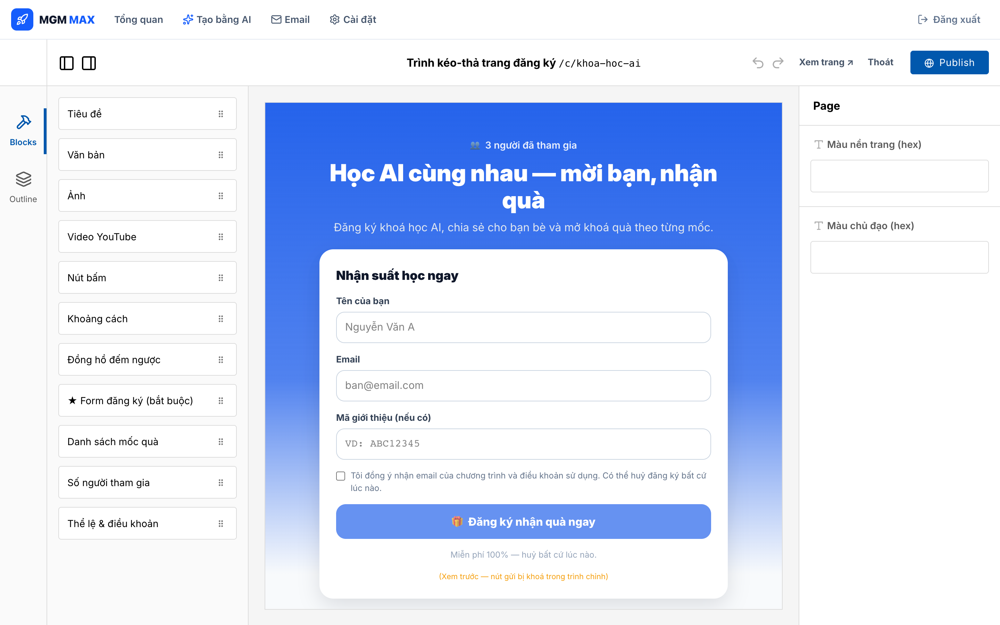
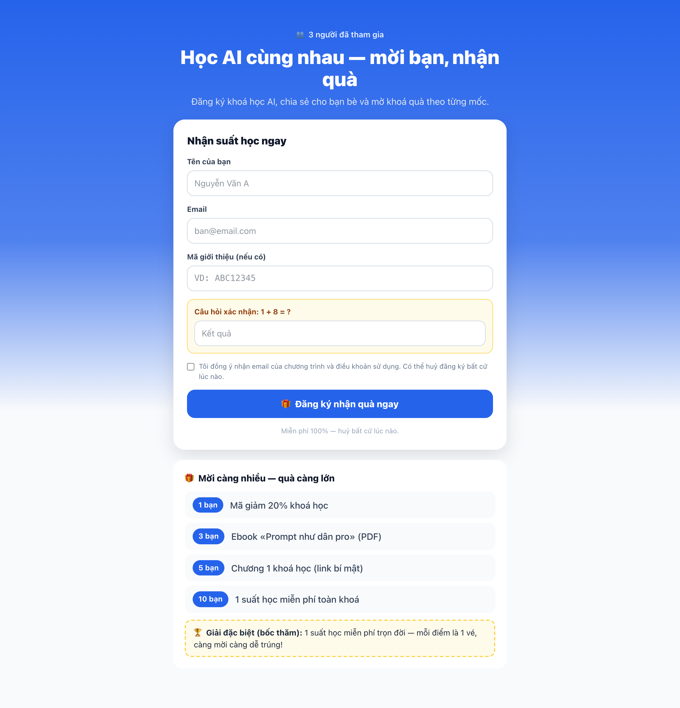
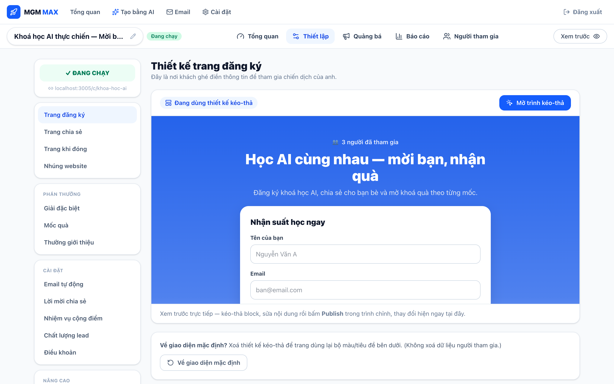
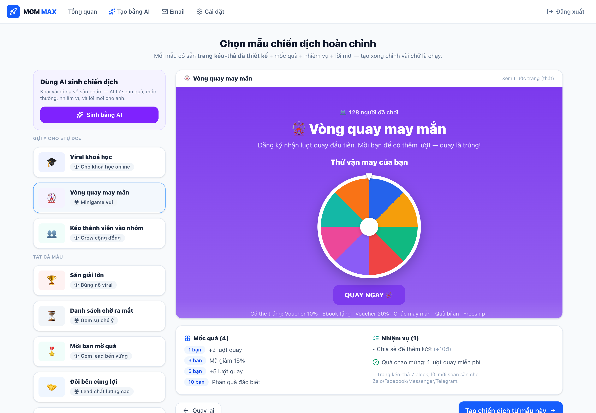
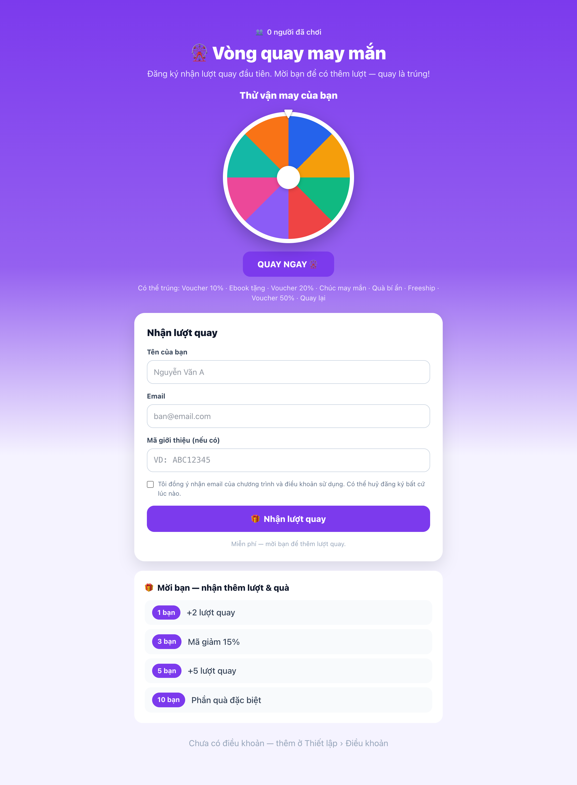
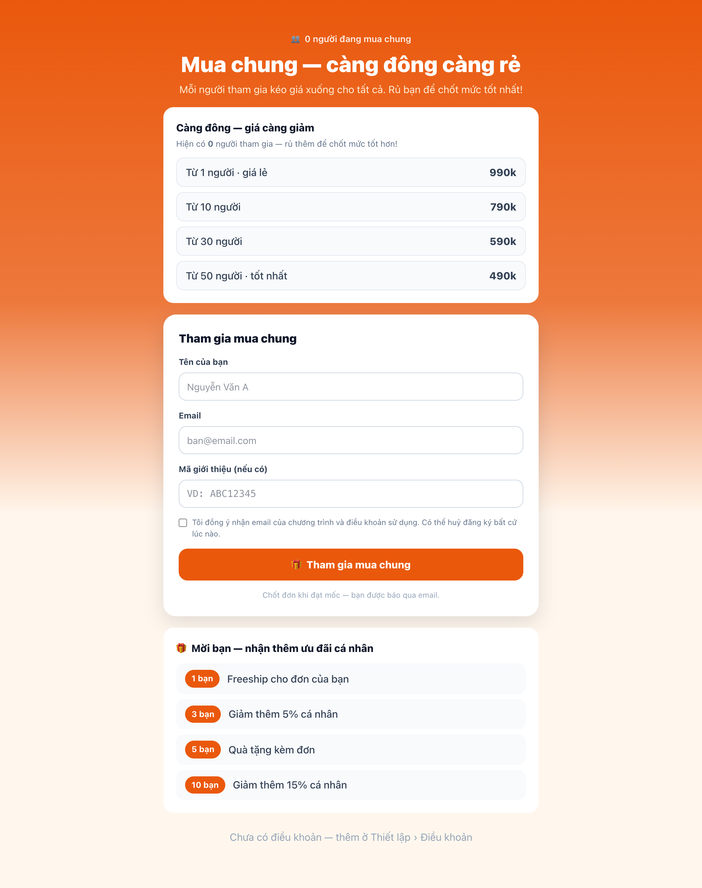
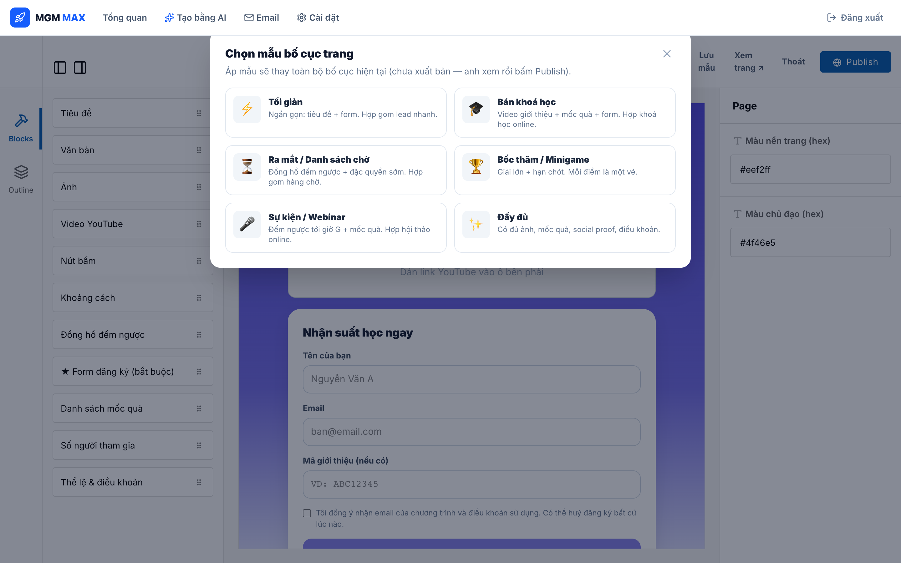
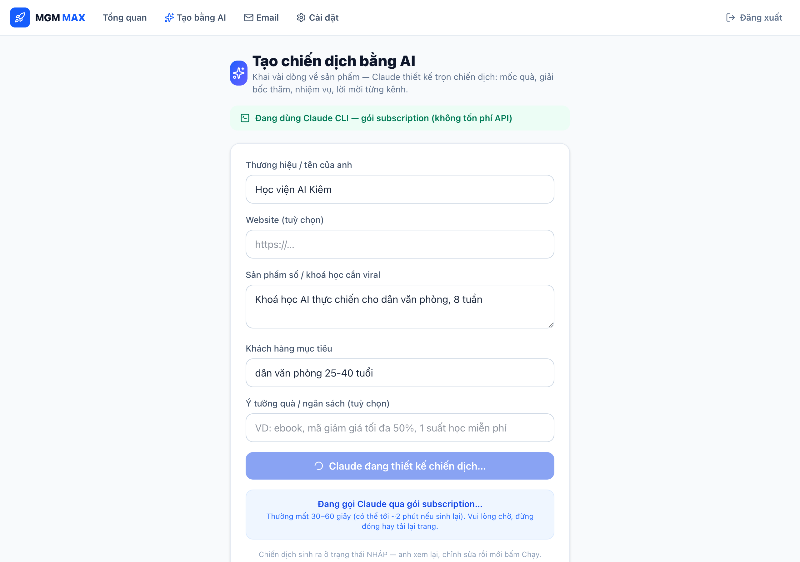
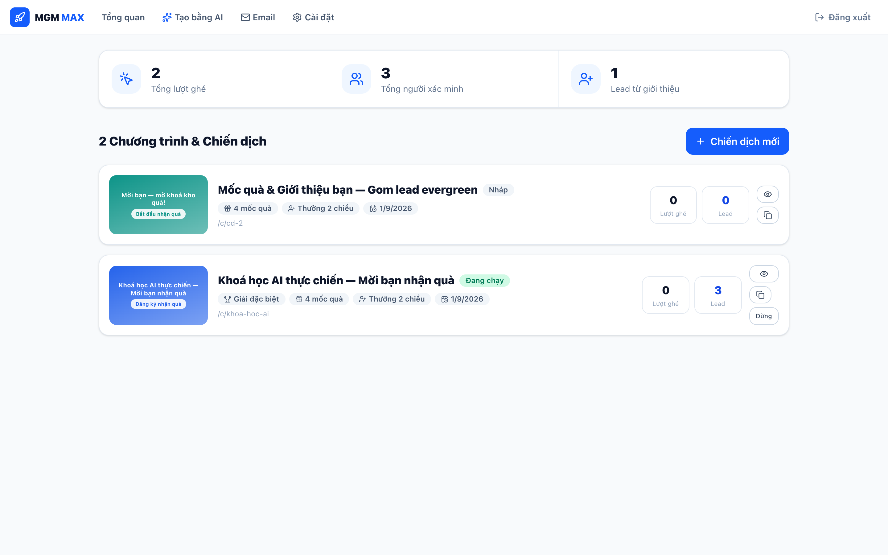

# MGM MAX 🚀

Nền tảng chiến dịch **viral member-get-member** (mời bạn → nhận quà) cho sản phẩm số & khoá học online. Tự xây theo mô hình UpViral nhưng làm hơn ở: **thưởng hai chiều**, mốc quà tính theo số bạn **đã xác minh**, sổ cái điểm có log minh bạch, bốc thăm seed tất định, K-factor, và kênh chia sẻ cho thị trường Việt (Zalo / Facebook / Messenger).

> **Stack:** Next.js 15 (App Router) · PostgreSQL (pg thuần, không ORM) · Tailwind v4 · TypeScript · chạy ở cổng **3005**.

---

## ✨ Điểm nổi bật: Trình KÉO-THẢ thiết kế trang đăng ký

Mỗi chiến dịch có một trình dựng trang **kéo-thả trực quan** (dựng trên [Puck](https://github.com/puckeditor/puck) — MIT): kéo block từ cột trái, sửa thuộc tính ở cột phải, bấm **Publish** là trang khách đổi ngay. Không cần code, không cần chạm HTML.



**11 block dựng sẵn** (thuần tiếng Việt): Tiêu đề · Văn bản · Ảnh · Video YouTube · Nút bấm · Khoảng cách · Đồng hồ đếm ngược · **★ Form đăng ký thật** · Danh sách mốc quà · Số người tham gia · Thể lệ & điều khoản.

- **Form đăng ký là hàng thật, không phải mockup:** block tự POST vào `/api/dang-ky`, tự lấy `slug` / mã giới thiệu / **captcha** / trường tuỳ chỉnh / mốc quà từ dữ liệu chiến dịch — giữ nguyên chống gian lận và double opt-in.
- **Nhẹ cho khách:** trang công khai render bằng `Render` (React Server Component) — chỉ +721 B, **không** tải bundle của editor.
- **An toàn quay đầu:** chưa thiết kế kéo-thả thì trang dùng giao diện mặc định; có nút “Về giao diện mặc định” để hoàn tác bất cứ lúc nào (không đụng dữ liệu người tham gia).

| Trang khách (render từ layout kéo-thả) | Bảng thiết lập chiến dịch |
| --- | --- |
|  |  |

---

## 🎨 Template toàn diện

Hai lớp mẫu để khởi động trong vài giây:

**15 mẫu chiến dịch hoàn chỉnh** — mỗi mẫu tạo sẵn **trang kéo-thả đã thiết kế + mốc quà thật + quà chào mừng + giải bốc thăm + nhiệm vụ (đáp án hợp lệ) + lời mời từng kênh + bộ email mẫu tailored** (chào mừng, mời thành công, sắp chạm mốc, mở quà, trúng giải). Xem trước bằng chính trang thật, tạo xong chỉnh vài chữ là chạy:

> 🏆 Săn giải lớn · ⏳ Danh sách chờ ra mắt · 🎖️ Mời bạn mở quà · 🤝 Đôi bên cùng lợi · 🎓 Viral khoá học · 🛒 Mua chung mở giá · ⚡ Flash Sale giờ vàng · 🎡 Vòng quay may mắn · 🏅 Cuộc thi sáng tạo (UGC) · 📖 Tặng ebook lan toả · 💝 Tri ân khách cũ · 🧑‍💼 Cộng tác viên nhận quà · 👥 Kéo thành viên vào nhóm · 🔓 Học nhỏ giọt · 📱 Mời tải app



Có block tương tác riêng cho mẫu đặc thù — **Vòng quay may mắn** và **Bậc giá mua chung** (giá giảm theo tổng số người tham gia):

| 🎡 Vòng quay may mắn | 🛒 Mua chung mở giá |
| --- | --- |
|  |  |

**Thư viện mẫu trang trong editor** — trong trình kéo-thả bấm **Mẫu trang** để áp 1 trong 6 bố cục dựng sẵn (Tối giản · Bán khoá học · Ra mắt · Bốc thăm · Sự kiện · Đầy đủ), hoặc **Lưu mẫu** để cất bố cục đang dựng và tái dùng cho chiến dịch khác.



---

## 🧩 Tính năng chính

**Vòng lặp viral**
- Sổ cái điểm **append-only** (`so_diem`), mọi khoản cộng đều idempotent bằng UNIQUE tầng DB → không bao giờ cộng đôi.
- **Mốc quà theo số bạn đã xác minh** (không theo điểm ảo); trao quà hai chiều (người mời + người được mời).
- Kho coupon phát tự động, khoá hàng an toàn `FOR UPDATE SKIP LOCKED` → không phát trùng.
- **Bốc thăm trọng số điểm** có seed tất định + log (tái lập được, minh bạch); leaderboard tie-break rõ ràng; đo K-factor.
- Attribution 2 pha (cookie → DB), link giới thiệu `/r/[ma]?ch=kênh`, trang riêng `/toi/[ma]`.

**Referral AI** — tạo trọn chiến dịch (tên, mô tả, mốc quà, lời mời từng kênh) bằng một câu mô tả. Gọi Claude qua **CLI gói subscription** (không tốn API key) hoặc `@anthropic-ai/sdk` khi có `ANTHROPIC_API_KEY`.



**Chống gian lận & bảo mật**
- Double opt-in (xác minh email mới tính điểm), captcha toán **tự bật** khi 1 IP đăng ký nhiều lần, blacklist IP, chấm điểm rủi ro → cách ly.
- Link một-chạm `/nhanh/[slug]` cần **token HMAC của chiến dịch** + giới hạn IP/ngày.
- Cron bảo vệ bằng `CRON_SECRET`; link trong email dùng base URL **tin cậy** (không tin header) chống đầu độc; các endpoint chặn thao tác khi chiến dịch đã đóng.

**Marketing & vận hành**
- Email tự động qua hàng đợi có retry (welcome, mời, đạt mốc, digest…), **broadcast**, xem trước ở chế độ giả lập.
- Widget **nhúng website** (`/nhung` + `popup.js`), theo dõi nguồn **UTM** (`/t/[cd]/[keyword]`), **trường form tuỳ chỉnh**, OG (ảnh/tiêu đề chia sẻ) per chiến dịch, webhook 5 sự kiện, import CSV.

**Quản trị** — dashboard tài khoản, wizard tạo chiến dịch, khung điều-hướng-theo-chiến-dịch (Tổng quan · Thiết lập · Quảng bá · Báo cáo · Người tham gia) với biểu đồ 14 ngày.



---

## ▶️ Chạy local

```bash
createdb mgm_max          # Postgres local
pnpm install
pnpm db:init              # áp schema (db/schema.sql)
pnpm db:seed              # chiến dịch demo "khoa-hoc-ai"
pnpm dev                  # http://localhost:3005
```

- Trang công khai: `http://localhost:3005/c/khoa-hoc-ai`
- Quản trị: `http://localhost:3005/admin` — mật khẩu mặc định `mgmmax123` (đổi bằng `ADMIN_MAT_KHAU`)
- Thiết kế trang: **Admin → chiến dịch → Thiết lập → Trang đăng ký → Mở trình kéo-thả**
- Test core: `pnpm test`

## ☁️ Đưa lên Cloudflare (quick tunnel)

```bash
pnpm build && pnpm start &
./deploy/len-cloudflare.sh    # in ra link https://….trycloudflare.com
```

## ⚙️ Cấu hình (`.env`)

| Biến | Ý nghĩa |
| --- | --- |
| `DATABASE_URL` | Chuỗi kết nối Postgres |
| `ADMIN_MAT_KHAU` | Mật khẩu admin (mặc định `mgmmax123`) |
| `RESEND_API_KEY` + `EMAIL_FROM` | Gửi email thật (bỏ trống = giả lập, xem trong Admin → Email) |
| `MGM_AI_MODE` · `ANTHROPIC_API_KEY` · `CLAUDE_MODEL` | Referral AI (`cli` gói sub hoặc `api`) |
| **`CRON_SECRET`** | **Bắt buộc khi deploy thật** — bảo vệ `/api/cron` |
| **`APP_BASE_URL`** | **Bắt buộc khi deploy thật** — URL công khai cho link trong email (hoặc điền “URL công khai” trong Cài đặt) |

> Chiến dịch có **chế độ demo**: hiện nút “Xác minh ngay” trên trang cảm ơn để chạy thử trọn vòng lặp không cần hộp thư thật.

## 🏗️ Kiến trúc

- `src/core/` — logic thuần có test (`pnpm test`): mã Base32 Crockford, bốc thăm trọng số seed tất định, chấm điểm rủi ro, mốc quà, xếp hạng, K-factor.
- `src/services/` — nghiệp vụ chạm DB: đăng ký + attribution, xác minh double opt-in, sổ cái điểm, trao quà, hàng đợi email, thống kê, `ky.ts` (token HMAC), `trang-meta.ts` (dữ liệu cho trình kéo-thả).
- `src/ui/puck/` — **trình kéo-thả**: `config.tsx` (11 block dùng chung editor + public), `PuckStudio.tsx` (editor client).
- `src/app/` — Next.js App Router: opt-in `/c/[slug]`, link giới thiệu `/r/[ma]`, trang riêng `/toi/[ma]`, xác minh `/xac-minh/[token]`, editor `/admin/editor/[id]`, admin đầy đủ tại `/admin`.
- `db/schema.sql` — mọi ràng buộc chống trùng (1 người 1 người mời, điểm/quà/coupon không nhân đôi) nằm ở UNIQUE tầng DB.

Tài liệu nghiên cứu & phương án: xem thư mục [`tai-lieu/`](tai-lieu/).
